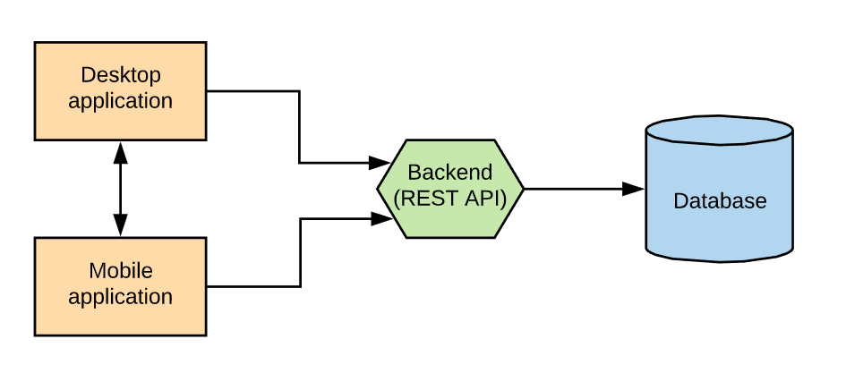

[<-- BACK TO ROOT](../README.md)

# **Java**

Java is a compiled programming language, class-based and object-oriented, which is most used for backend and mobile development.

The **main objective** with this language is to create software that has a desktop and a mobile app, and both communicate with the same backend. The following diagram shows the idea that motivates the learning of this language:

Right now we are in the learning and practice stage, but the goal is on track.

### Projects:

+ [REST API](./HernanCano/API_REST/README.md) - Hernán Cano

### Sub-directories:

+ [Enzo Avena](./EnzoAvena/README.md)
+ [Hernán Cano](./HernanCano/README.md)

[<-- BACK TO ROOT](../README.md)
